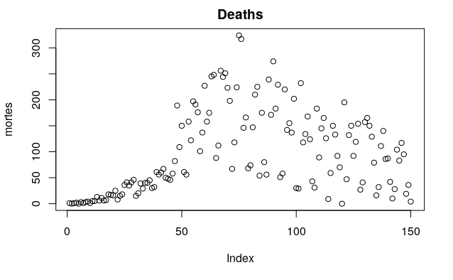
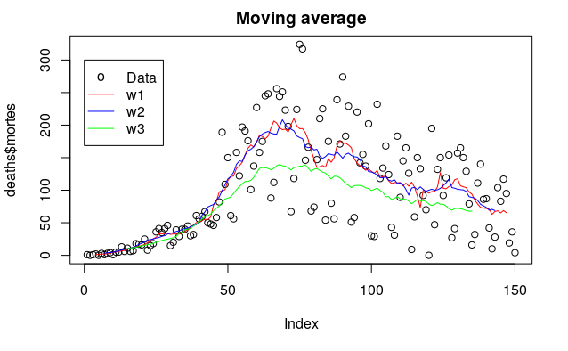
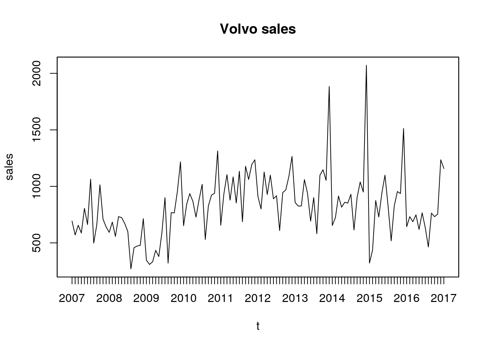
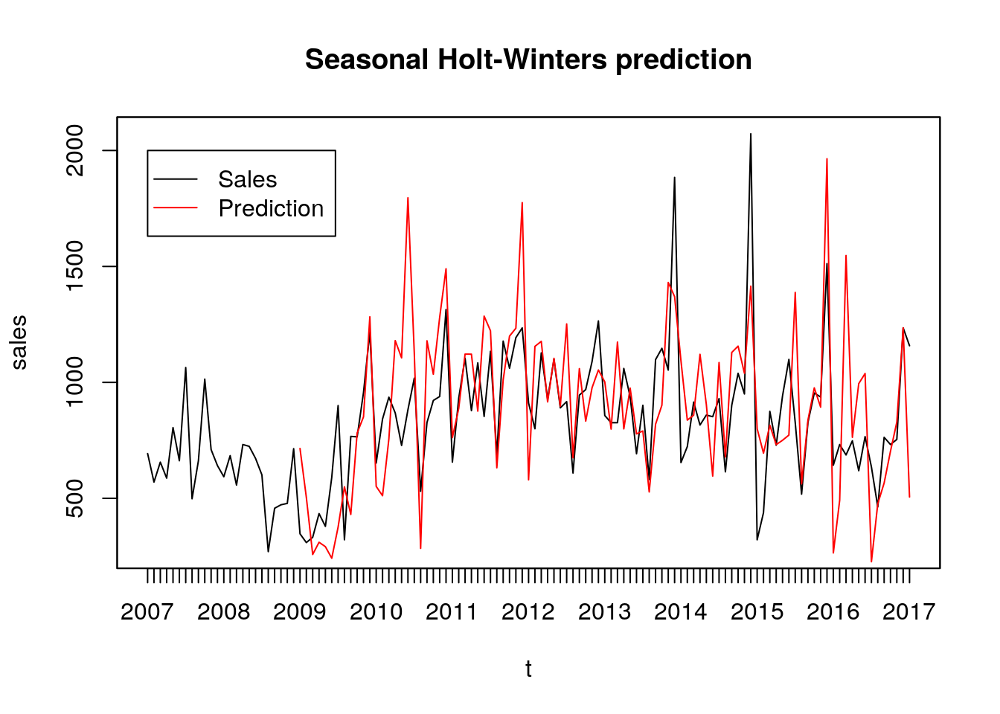

# time-series

Assignment codes for [Time Series](https://emap.fgv.br/sites/emap.fgv.br/files/u77/series_temporais.pdf) (2020, FGV).

We analysed and modeled two times series. We also tried to predict the second one.

## Covid-19 deaths

We analysed Covid-19 deaths in Rio de Janeiro, Brazil, between 2020/03/20 and 2020/08/17.

We tried various models to trend:
- Linear
- Polynomial
- Moving average
- LOWESS

We can see, for example, some results from moving average.

We also modeled seasonality:
- Deterministic
- Deterministic and multiplicative
- Stochastic

## Car sales from Volvo

We modeled car sales from Volvo between 2007 and 2016.

We fitted various models in a window of two years, trying to predict next day. Among them:
- Regression with seasonal dummies
- Polynomial regression
- Exponential smoothing
- Holt
- Additive Holt-Winters
- Multiplicative Holt-Winters

For example, we can see results from Multiplicative Holt-Winters:

